# Navigating Networks: A Reinforcement Learning Approach to Path Optimization
### Reinforcement Learning for Routing

Authors: Giovani, Maria Vitória Rodrigues Oliveira (262884), Marcos 

Networks consist of nodes and edges, where nodes may represent entities such as people or animals, and edges signify their connections or relationships, such as social ties or the food chain. In the context of Geographic Networks, the scenario's geographic area is virtualized. In this virtual representation, vertices symbolize road corners, and edges delineate the streets, capturing the spatial relationships within the network.

The shortest path between two nodes in a network may suggest the route with the minimum distance, reduced fuel consumption, or even a shorter time requirement. The edge cost of a Geographic Network could be the distance between the two nodes. In this perspective, this work presents optimized routes between two nodes in a geographic network, comparing the performance of different reinforcement learning methods.

Our objective is to use reinforcement learning in the problem of path finding for a trash collector truck. An optimized path can help obtain a faster and more efficient trash collection. The problem can be modeled as finding the shortest path between two nodes in a graph, which has already been previously solved using other optimization approaches, heuristics, and graph algorithms. However, we want to apply reinforcement learning to this problem both for educational purposes and compare it with different approaches.

 The problem can be defined as follows:

**Definition:** With a weighted directed graph $G = (V, E)$, and a starting node $v$, find the shortest path to node $u$, i.e., the subset of $E$ that connects $v$ to $u$ and has a minimal sum of edges weights.

## Reinforcement learning formulation

### Markov Decision Process

- Episodic: The episode ends when the agent arrives on the destination node or in a node without leaving edges.
- The time discretization occurs at the nodes of the graph, i.e., the crossings of the streets in which the agent needs to make a decision of which direction to follow.
- States: $n$ states $v_i \in V$, each is a node of the graph.
- Actions: $n$ actions, each one corresponds to moving to a specific node. It is important to note that the possible actions are dependent on each state. The action of moving to node $u$, if the state is node $v$, can only be made if there is an edge from $v$ to $u$.

### Rewards

There are two considered reward schemes:

- *Unit*: receives a reward of 10000 if reaches the goal, reward -1 for choosing to stay at the same position, -1000 if leaves to a dead end, and 0 for other possible actions (valid movements in the graph). It is a sparse reward scheme.
- *Weighted*: receives reward 10000 if reaches the goal, reward -1 for choosing to stay at the same position, -1000 if leaves to a dead end, and $-w_{u, v}$ for other possible actions (valid movements in the graph). $w_{u, v}$ is the weight of the edge between $u$ and $v$ normalized by the maximum weight of edges.

These reward setups were designed with the intent to force some behaviors in the agent. The negative reward of $-1$ is so that the agent does not learn to stay in the same position. The negative reward of $-1000$ at dead ends is also to force the agent to avoid dead ends with few visits. 

In the *unit* reward scheme, there is no use of the edge weights, so there is no information for the agent to learn the optimal path; the only objective is to reach the goal. In the *weighted* reward scheme, we incorporate the edge weights as negative rewards. As the objective is to obtain the path with the shortest path, we need to minimize the sum of the weights of the edges or maximize the negative of the sum. This could teach the model to stay at the same position, as both staying at the same position or selecting a new node will have negative weights. However, the weights are normalized, and only the maximum $w_{u, v}$ will be equal $-w_{u, v} = -11$ (the reward of staying in the same node).

### Environment

We implemented our environment using Numpy, OSMnx, and Networkx libraries to support graph objects. The scenario is a Geographic Network of Campinas city, in São Paulo, Brazil. It contains 605 nodes representing corners, and the edges correspond to streets for cars. Figure 1 presents the network.

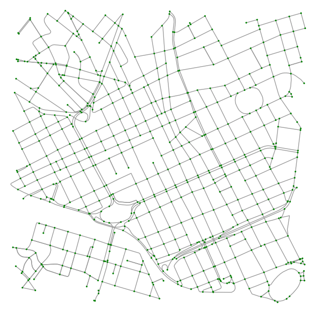

         Figure 1 - Campinas city network

The environment keeps the current state of the simulation and has the step method. This method receives an action and, according to the current state, returns to the new state of performing this action. It also returns the reward obtained from the action. If the action is possible, i.e., there is an edge from
the state $v$ to the action node $u$, it performs the step and updates the state. Otherwise, the state stays at $v$.

We implemented deterministic and stochastic environments. The stochastic step has two extra details. First, an action has a random probability of not being possible (we used 5%). Secondly, we add a random Gaussian noise to the weights of the edges; this noise is sampled at each step so that the same edge will have different weights at different iterations. Our intention with this stochastic implementation is to simulate the uncertainty of transit; some streets can be randomly inaccessible, and the cost of going through a street can also have different values depending on the day, time of the day, climate, etc.

## Experimentation setup

Each of the reinforcement learning models will have some parameters that need to be selected, and different scenarios have different optimal values. For that reason, a common experiment among all methods will be the study of the impact of parameter values on the path cost, computational time, and mean reward. It is also important to analyze how the agent works in the four possible scenarios of environment and reward: (deterministic, unit), (deterministic, weighted), (stochastic, unit), and (stochastic, weighted). Using a fixed source and target, for each value of a list of selected parameter values, we will execute the training with 20 different random seeds; this will permit us to obtain a distribution of the metrics.

## Monte-Carlo

According to Richard S. Sutton and Andrew G. Barto (2018), for each state-action pair, the Monte Carlo methods sample and average returns. From the perspective of the previous state, the problem becomes non-stationary since every action choice is undergoing learning. Considering the theoretical assumptions of Monte Carlo, we implemented this method using epsilon-greedy in two configurations: the first uses the parameters fixed discount factor $\gamma$ = 0.9, $\alpha$ = 1/ $N_{\textrm{0}}$, and $\varepsilon$ = $N_{\textrm{0}}$ / $N_{\textrm{0}}$ + $N_{\textrm{s(t)}}$. The second one applies the $\varepsilon$ variable, which decays linearly during the training. In this case, we defined each experiment's discount factor $\gamma$, the $\varepsilon_{\textrm{min}}$ and $\varepsilon_{\textrm{max}}$.

### Experiments

The experiments of Monte Carlo methods are performed on a computer with Intel(R) Core(TM) i5-10210U CPU $@$ 1.60GHz, 4 cores, 2 threads per core, Memory 8 GB, and Linux Ubuntu 22.04.3 LTS.

The first experiment implements three different values for $N{\textrm{0}}$: 200, 600, and 1000. These values are fixed during model's training. We use the $N{\textrm{0}}$ variable to update $\varepsilon$ and $\alpha$, which decreases during training. The Figure below presents the results of the cost, computational time, and rewards for unit reward and deterministic environment. The cost represents the total distance of the route; the computational time shows the training duration, and the rewards are obtained during the training of the model.

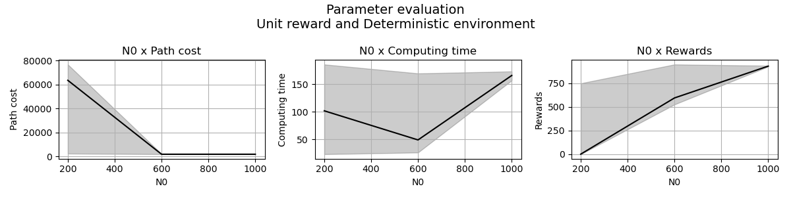

         Figure 2 - Cost, computational time and reward obtained in unit deterministic environment

According to the Figure, the experiment demonstrates its most inferior performance when the N0 variable is 200, because its configuration implies in routes with high values of route cost. Also, the obtained reward values are lower. We obtained a decrease in the average cost of the route, that is, the total distance traveled, as we increased the value of N0 while the average rewards increased. Its behavior indicates that when N0 equals one thousand, we have routes that reach the target using shorter paths. Also, the computational time for executing model training increases when N0 equals one thousand. Continuing in the deterministic environment, Figure 2 below represents the results for weighted reward.

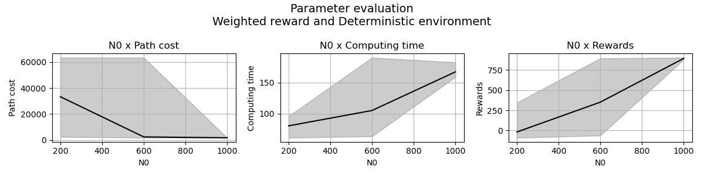

          Figure 3 - Cost, computational time and reward obtained in weighted deterministic environment

The main difference between unit and weighted reward results in a deterministic environment is that N0 600 has more variance in results. However, in both reward methods, the N0 1000 achieves a route mean cost close to the optimal 1700. In this perspective, in the weighted deterministic scenario, we have N0 1000 as the best result despite the increase in the computational time of execution. Figure 3 shows the unit stochastic environment.

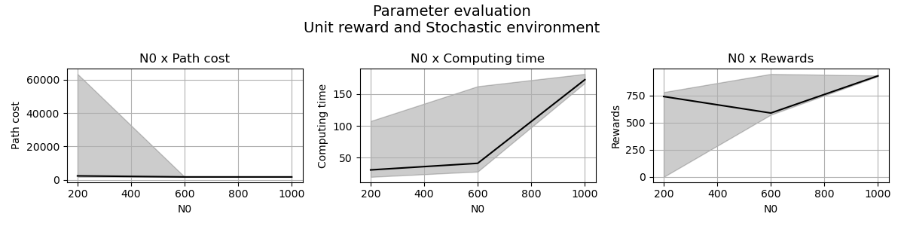

          Figure 4 - Cost, computational time and reward obtained in unit stochastic environment

In the unit reward and stochastic environment, the cost result was more stable for different values of N0. According to the execution time graphic, the value 1000 for N0 corresponds to an average computational time of more than 150 seconds. Still, its configuration represents the best mean route cost and mean reward obtained. Then, Figure 4 shows the weighted stochastic environment.

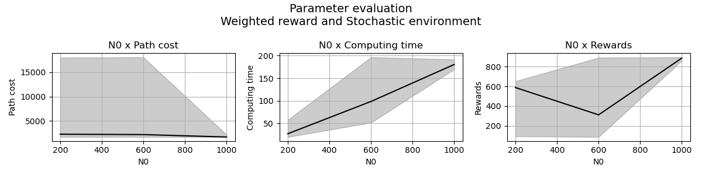

           Figure 5 - Cost, computational time and reward obtained in weighted stochastic environment

Both weighted and unit reward methods perform similarly, achieving a value of more than 800 as the mean reward when N0 equals 1000. A difference from deterministic environment is that the mean of rewards when N0 600 is worst than other N0 values. However, N0 1000 is the best result for all reward methods and environments.

The second experiment applies different values for discount factor $\gamma$ and $\varepsilon_{\textrm{min}}$, which are fixed during model's training. In this case, we do not use $\alpha$ and the $\varepsilon$ decays linearly from maximum until minimum value. The Figure bellow presents the unit reward and deterministic environment.

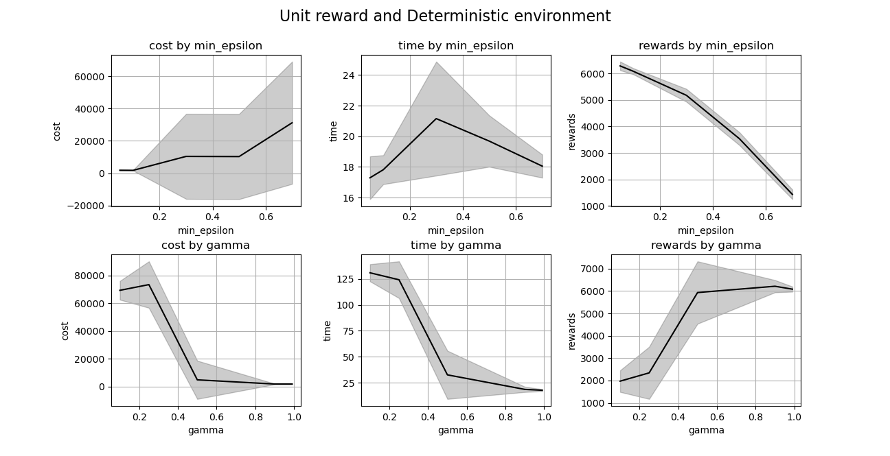

           Figure 6 - Cost, computational time and reward obtained in unit deterministic environment

According to the Figure, increasing the value of $\varepsilon_{\textrm{min}}$ also increases the mean of the cost metric, representing the route's total distance. In this sense, it receives higher rewards in lower $\varepsilon_{\textrm{min}}$ values. In this perspective, it is more suitable to use the 0.1 value, which also performs better in computational time. Also, increasing the discount factor gamma ($\gamma$) performs better on cost, computational time, and reward metrics. The unit deterministic model's behavior is similar to the unit stochastic, as shown in the Figure below.

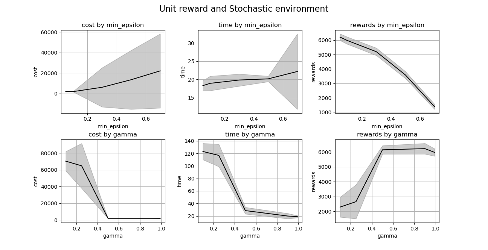

           Figure 7 - Cost, computational time and reward obtained in unit stochastic environment

In the stochastic environment, the model performs better when it implements low values of minimum epsilon (between 0 and 1) and high values of the discount factor gamma < 1. There is no significant difference between deterministic and stochastic environments using unit reward. The weighted reward had more differences, which is shown in the Figure below.

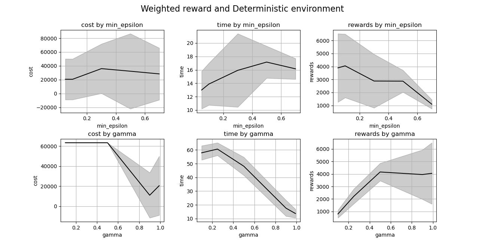

           Figure 8 - Cost, computational time and reward obtained in weighted deterministic environment

The route cost of weighted deterministic model do not have many variations, but the rewards are higher on low values of minimum epsilon, which indicates a better performance. Besides, the rewards have stabilized between 0.5 and 0.99 values, but the mean cost is lower on 0.9 gamma value, which represents a route with few nodes (shortest). This behavior is similat to weighted stochastic environment, as the figure below shows.

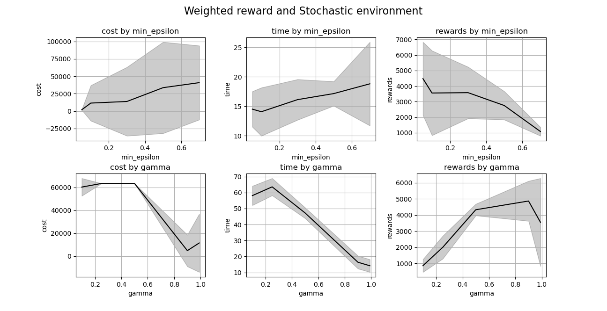

           Figure 9 - Cost, computational time and reward obtained in weighted stochastic environment

According to the Figure, the best gamma value for the experiment is 0.9, as it achieves the higher reward mean value with lower route distance cost and a low computational time. Despite the values of the minimum epsilon do not demonstrate significant differences on the results, the lower values are better the values close to 1. The weighted reward models minimizes the mean rewards of the obteined routes, which indicates that less routes reached the target then unit reward models.

### Generalization

We implemented an experiment for analyse the generalization of the policy obtained in model's training on Monte Carlo. In this case, we consider a unique sorce and target during training, but we try to reach target from each sorce of the network using the deterministic policy. Then, the Figure 10 shows the results for unit reward and deterministic environment.

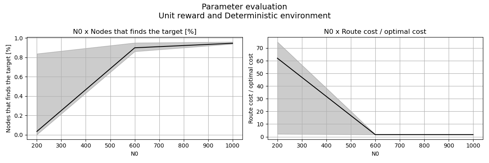

           Figure 10 - Nodes that reached target and route cost relation with optimal cost in unit deterministic environment

According to Figure 10, the mean percentage of starting nodes that reach the target using the deterministic policy is low when N0 equals 200 and close to 100% when N0 equals 1000. Also, N0 equals 600, and 1000 implies routes with values relative to 1 on the relation between route cost and optimal cost. It confirms that N0 1000 is the best value obtained in experiments. Figure 11 presents the same metrics for weighted deterministic environment.

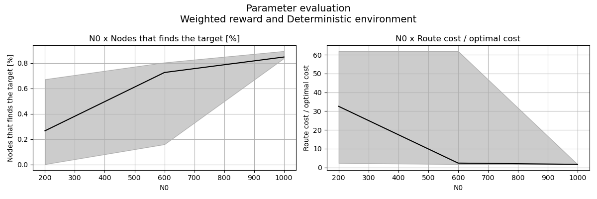

           Figure 11 - Nodes that reached target and route cost relation with optimal cost in weighted deterministic environment

The mean number of source nodes that reached the target in a weighted deterministic environment is better using N0 200. Still, it is worse when N0 is 600 and 900, compared with a unit deterministic environment. Besides, it shows more variance in results. N0 1000 has continued to be the best value. Figure 12 presents the generalization results for unit stochastic environment.

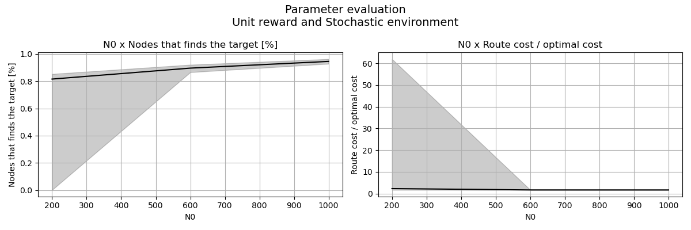

           Figure 12 - Nodes that reached target and route cost relation with optimal cost in unit stochastic environment

According to Figure 12, the unit stochastic environment acquires better mean values of nodes that reached the target and the relation of route cost and optimal cost than the deterministic environment. Also, it presents stable mean results despite having more variance on N0 200. Continuing in stochastic, Figure 13 shows results for the weighted reward method.

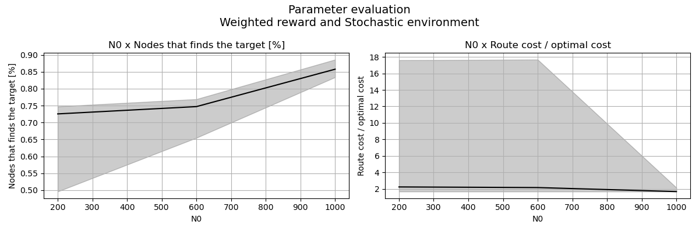

           Figure 13 - Nodes that reached target and route cost relation with optimal cost in weighted stochastic environment

The weighted reward method has more variance on N0 600 than the unit method using a stochastic environment. In this comparison, fewer nodes achieve the target in weighted reward. In this perspective, the unit stochastic environment performs better using N0 200 and 600, but all configurations obtained almost the same behavior for N0 1000.

## Q-learning

### Implementation details

Q-learning was implemented using the epsilon-greedy policy, with linear decay, achieving a value $\varepsilon_{\textrm{min}}$ at the final iteration. Both the $\varepsilon_{\textrm{max}}$ and $\varepsilon_{\textrm{min}}$ are parameters of the agent, however, there is no reason to have $\varepsilon_{\textrm{max}} \neq 1$. Another parameter was the learning rate $\alpha$, which was kept fixed during training (without learning rate decay). Good values for the learning rate are in the interval $[0, 1]$. Other parameters are the discount factor $\gamma$, the maximum number of steps per episode, and the number of episodes.

The Q-matrix was initialized with all values equal to $0$ and $-\infty$ in pairs $(s, a)$ that are not valid state-actions, i.e., pairs that there isn't an edge leaving node $s$ to $a$. The value $-\infty$ was used so that these pairs are not selected as the argmax values in the greedy policy. 

### Experiments

#### Parameters analysis

Our agent has two main parameters that need to be considered: the learning rate $\alpha$ and the weight of future rewards $\gamma$. The $\alpha$ values tested are $\{0.05, 0.1, 0.3, 0.5, 0.7\}$, and the $\gamma$ values are $\{0.1, 0.25, 0.5, 0.9, 0.99\}$. When varying $\alpha$, $\gamma = 0.99$, when varying $\gamma$, $\alpha = 0.7$. The experiments were performed with $1000$ episodes of $1000$ steps at max each.

The following figures present the results of our experiments. Looking at the first column, we see that every reward scheme and environment reached the optimal cost (around 1700) with some parameter value. The optimal policies were obtained with higher $\gamma$ values as expected. Looking at the figures of the unit reward scheme of deterministic and stochastic environments, we see that there is not a big relation between the parameter values and the metrics. Because there is no clear tendency to increase or decrease, and the deviation (a grey area) is really big.

Looking at the third column of the plots of weighted reward with deterministic or stochastic environment, we can see that the learning rate of 0.3 obtained high values of mean reward, and in the stochastic environment, a bigger learning rate resulted in lower performance. We can also see the positive outcome of increasing the $\gamma$. $\gamma$ values lower than 0.9 did not reached the optimal policy.

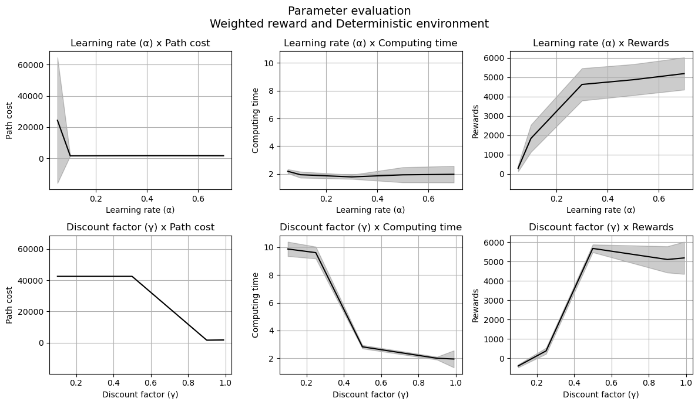

The stochastic enviroment presented similar results, but it was more sensitive to the learning rate, both low or high values resulted in low mean reward per episodes. 

#### Generalization

After identifying a good parameter value, it is important to evaluate if our agent is able to **generalize to different pairs of sources and targets using the different rewards and environments**. First, we selected 20 random source and target pairs and, using the optimal parameters found trained the agent to find the optimal paths. We saved the duration of the training, the average reward per episode,e and the ratio between the cost of the path found by our agent and the cost of the optimal path.

The next figure presents the results of this study, with three boxplots, one for each metric, showing the comparison between the reward schemes and environments. Looking first at the computing time, it is possible to see that there is not much difference, with all having around 2 seconds of computing time. Nextly, looking at the optimal path, we can see that despite all scenarios having the mean equal to 1 (it is really common to achieve the optimal path), using the weighted reward schemes, we obtained results with higher costs, the three quartile is around 1.6 times the cost of the optimal path. Next, looking at the rewards, we similarly obtained the same mean values, but the weighted environments had a bigger variance in the mean reward per episode; this could be caused because the 20 pairs of source and target will have different route costs. The overall analysis does not show that the scholastic environment was much harder in comparison to the deterministic.

The next analysis is to evaluate if an agent trained in a source and target pair can find a path from any of the states to the target and also if the path found is optimal. To do that, with a trained agent, we selected all possible states and calculated the route found by the policy to the target. We saved the information on whether the route was found and also the ratio of the cost found and the optimal cost.

The next figure shows the fraction of states such that the agent can start from and reach the target at different levels of training. It is possible to see that around 1000 training episodes, the agent can only reach the target from 50% of the states, but at 5000 episodes, it is able to reach more than 95% of the states. Following, we have another figure showing the routes found by the agent from the different sources (none of these sources were the ones that the model trained). It is possible to see that they have some intersections.

#### Value function

Another interesting analysis is to study how the value function learning by the agent differs at the unit and weighted reward scheme. To do that, we trained the two agents with 1000 episodes with each of the reward schemes. Then, the value function can be obtained from the Q matrix by calculating the maximum value of each state. The following plot shows all states colored by the value function; the more red, the higher the value function. By comparing both plots, we can see that in the unit reward, many nodes that are neighbors of the target have high values, but in the weighted, only a few of them have. This could be caused because the weighted reward scheme prioritizes the nodes with the shortest distance and not any node near the target.

### QLearning with Linear Function

A different implementation of eLearning with linear function as a function approximator was also developed. By using the function approximator, we do not store the matrix Q and use the features of the state and the action to calculate the value of the Q matrix. Our function approximator has the following formulation:

$$f(X(s, a)) = w_0 + \sum_{i=0}^k X(s, a)_k w_k $$

Where $k$ is the dimension of the feature vector, these weights are updated with gradient descent applied in the error of the Bellman Equation with a learning rate $\alpha$. This implementation was based on this [reference](https://gibberblot.github.io/rl-notes/single-agent/function-approximation.html).

Our problem presents a discrete nature and few features that could be used. We designed a few options of features:

- (x,y) coordinates of state, number of neighbors of state, (x, y) coordinates of action, number of neighbors of action (dim 6)
- one hot encoding of state, one hot encoding of action, and the same features of the previous item (dim 2n + 6)

By using the position of states, we consider that nodes that are spatially close will have similarities in the Q values. However, by trying a few tests with this approach, it did not obtain an optimal policy. Then, we extended the features by adding one hot encoding.

### Experiments

Similarly, we performed experiments to identify the optimal parameter values in the different environments and reward schemes. However, as the training is higher than in the QLearning with table, we only evaluated the learning rate parameter. The rates considered were $[0.05, 0.1, 0.3, 0.5]$. It was also necessary to train agents with 5000 episodes, as it was not obtaining good results with fewer steps.

The results are displayed in the following graphs. The black line represents the median values, and the grey region marks the 1-3 quartile intervals.

We can see that in the deterministic environment, when the learning rate increased, the path cost was reduced, computing time was reduced, and mean rewards increased. After the value of the learning rate $0.3$, all runs obtained the optimal cost. There is also not a big difference between the computing time of units and weighted reward schemes.

Looking at the stochastic environment, we see a curious pattern that only the learning rate equal to $0.3$ was able to obtain the optimal policy, while the other values were not. These results also do not present a big difference between the unit and weighted reward schemes.

## SARSA

## DQN

DQN was implemented based on the QLearning algorithm. It was developed with PyTorch and using the reference from the [CartPole tutorial](https://pytorch.org/tutorials/intermediate/reinforcement_q_learning.html). The neural network utilized will have an output layer of size $n$ (number of nodes) and was implemented with four layers with dimensions that are a function of the size of the graph. The hidden dimensions are $k, k, 1.5n, 1.5n, n$, in which $k$ is the dimension of the feature vector. The features were similar to the ones used in the function approximator, with that change that now the features are only about the state, not about the action, i.e., we have the one-hot encoding of state and the (x,y) positions.

The DQN used a replay buffer of size 10000, and at each iteration of the environment, samples were selected from this replay buffer to train the networks. A few changes were necessary to use the DQN:

- The training duration was defined in the number of steps, not in the number of episodes;
- The environment was used only with the deterministic approach;
- The unit reward scheme was not tested;
- A new reward scheme was designed that returns $-0.5(w_{(s, a)} + d_{(s, a)})$, $d_{(a, t)}$ is the spatial distance between the node $a$ and the target $t$. This reward scheme was designed to incentivize the model to go to states closer to the target.
- We did not permit the target and online policy to select invalid actions; the objective was to reduce the computational cost of fitting many invalid movements;
- The max number of steps per episode (steps performed before resetting envoriment) was $n/2$ (half the number of nodes).

Based in the referece, at each step the weights of the target network $\theta_t$ are updated from the online netwotk $\theta_o$ following this smooth update rule: $\theta_t = \theta_t 0.005 + \theta_o 0.995$. This resulted in a more stable loss over training. The learning rate for the optimizer was of 1e-4.

### Performance study

Our initial tests showed that it was really difficult for the agent to learn the optimal policy, and as the training time of a single agent took several minutes, it was not possible to perform an exhaustive experiment of parameters. For that reason, we decided to apply it in smaller graphs and slowly increase the number of nodes of the graph to understand the capabilities of the agent. We can obtain smaller graphs by setting a radius and selecting only the network inside this radius. We tested this radius with sizes equal to 200, 400, and 600 and trained the enviroment with _weighted_ rewards and with _weighted+distance_ rewards.

#### Radius 200

Our first test with a radius of 200 and a weighted reward scheme was not able to achieve the optimal policy. By looking at the policy at different steps, we can see that the agent finds the optmal policy, but later changes it. The mean reward per episode starts decreasing after 1000 episodes. We can also verify that the value function makes sense (nods close to the target have higher value). By looking at the final policy of all states, we can see that we have almost the perfect path from source to target, missing only one edge.

This second test is using the _weighted+distance_ reward scheme, we obtain a similar behavior of the mean rewards per episode, but the final policy is the optmal one.

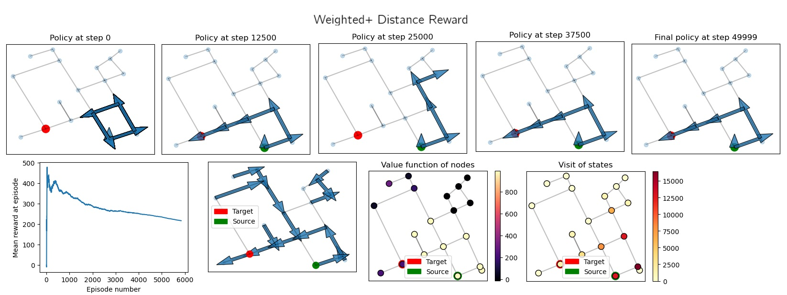

#### Radius 400

Similarly, we trained an agent with the weighted reward scheme in the 400 radius graph. We can see that the agent's policy reaches the target at the step 12500, but the final policy is not a desired one. Differently from before, we did not see a decrease of the mean reward overtime. We can see that many states point to the target, but the optimal policy is not achieved.

Performing the same training with the _weighted+distance_ reward scheme resulted in a worse performance, we cansee that the agent almost never gets close to the target.

#### Radius 600

By using the larger graph, with more than 100 nodes, we achive a similar result. Both _weighted_ and _weighted+distance_ were not able to obtain the optimal policy. We can see that the _weighted_ reach the target at step 12500, but later forgets it. We can still see this trend of mean reward decreasing overtime.

One hypothesis for the bad performance of the DQN (it is well known that it is tricky) is that our state space and action space are discrete and really large. The output of the network will be a vector of size $n$, which can be $605$ in our experiments, a really unusual application of the DQN. 

## Conclusion

This work evaluated suggestion route approaches using different Reinforcement Learning methods. Considering the Monte Carlo algorithm, the N0 1000 reduced the route cost, and its policy provided almost 100% generalization, as the new sources reached the target with the same deterministic policy. This method is suitable for both stochastic and deterministic environments and for unit and weighted rewards.

In future works, we suggest incorporating the algorithms into [SUMO](https://eclipse.dev/sumo/), a realistic simulation of urban mobility. In this case, it would be possible to integrate traffic, gas, velocity, and time into the environment. We also suggest adding stop points before reaching the target node.

## Contributions

- Enviroment: Giovani and Vitoria
- Monte Carlo: Vitoria
- QLearning: Giovani
- SARSA: Marcos
- DQN: Giovani
